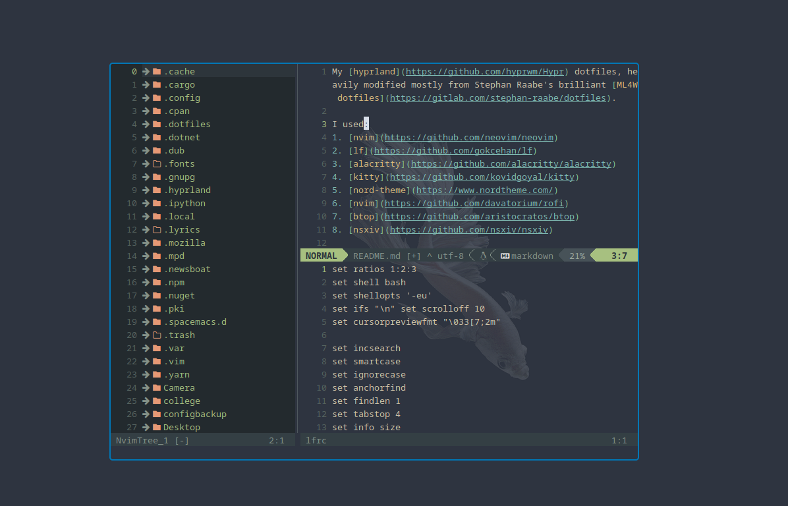
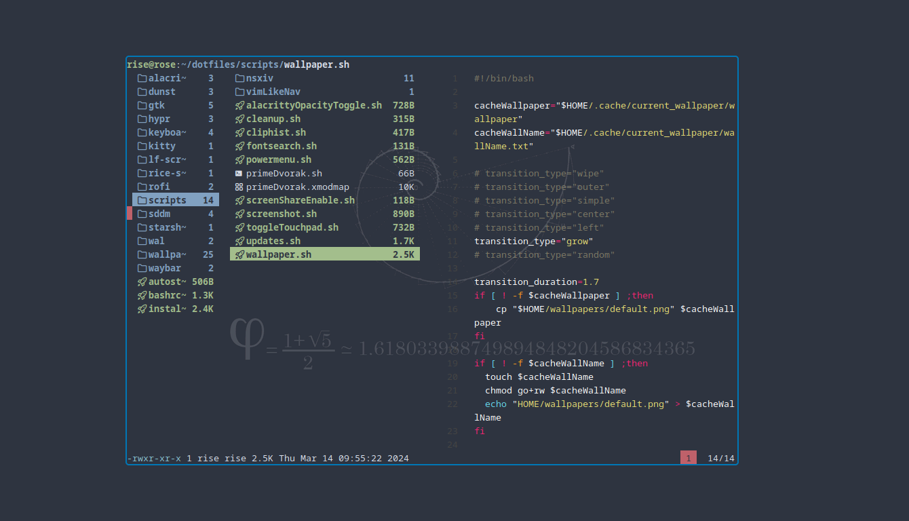
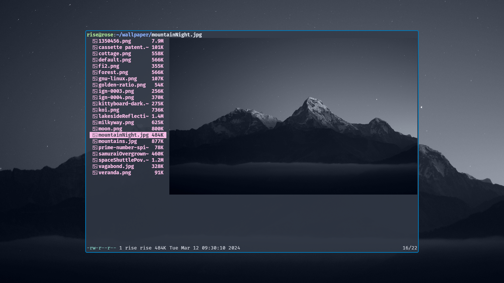
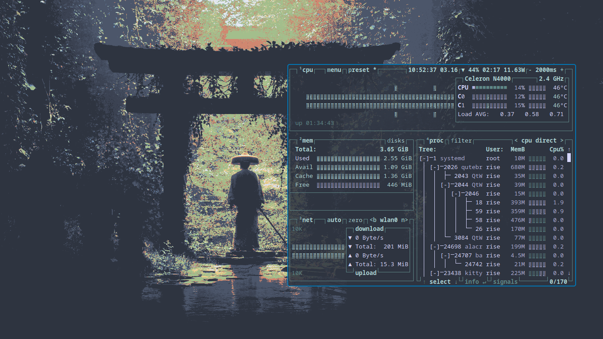
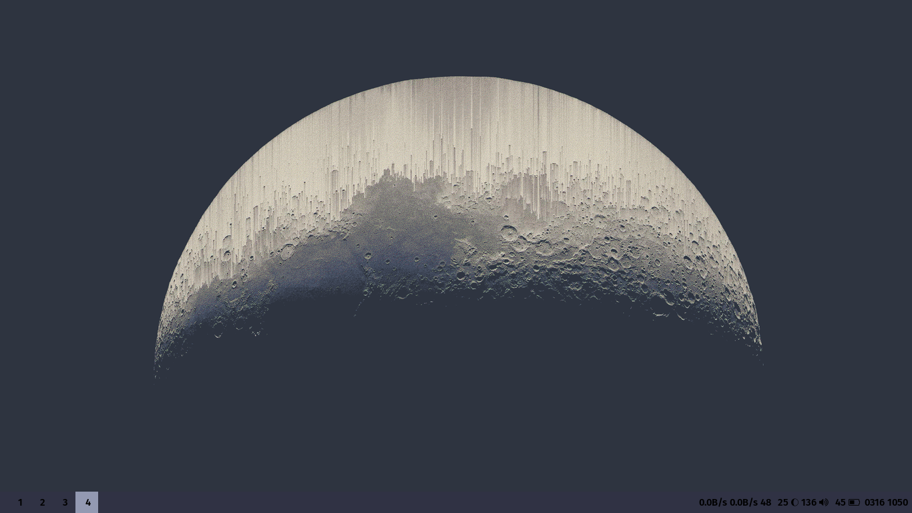
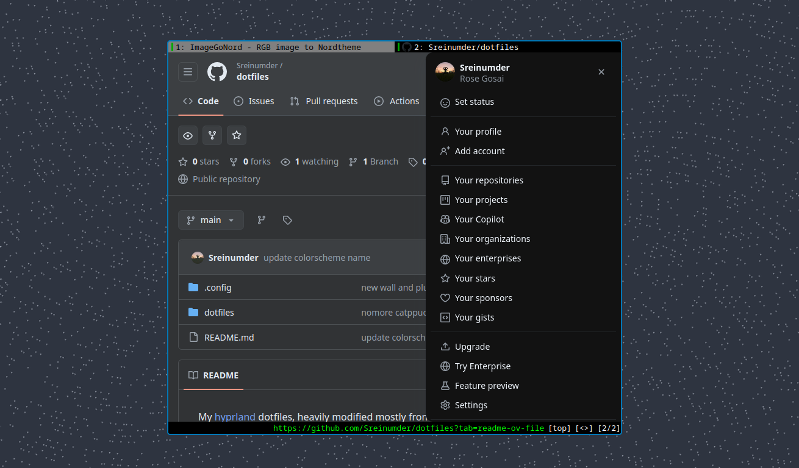

My [hyprland](https://github.com/hyprwm/Hypr) dotfiles, heavily modified mostly from Stephan Raabe's brilliant [ML4W dotfiles](https://gitlab.com/stephan-raabe/dotfiles).

I used:
[nvim](https://github.com/neovim/neovim)
[lf](https://github.com/gokcehan/lf)
[alacritty](https://github.com/alacritty/alacritty)
[kitty](https://github.com/kovidgoyal/kitty)
[nord-theme](https://www.nordtheme.com/)
[waybar](https://github.com/Alexays/Waybar)
[rofi](https://github.com/davatorium/rofi)
[quteBrowser](https://qutebrowser.org/)
[btop](https://github.com/aristocratos/btop)
[nsxiv](https://github.com/nsxiv/nsxiv)

Screenshots:

