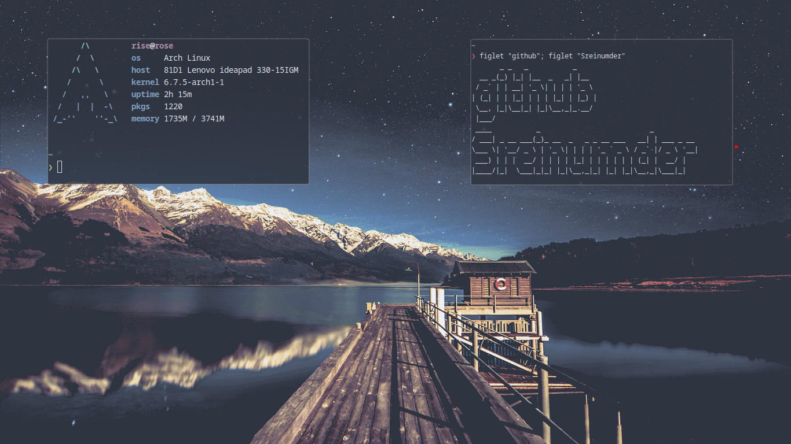
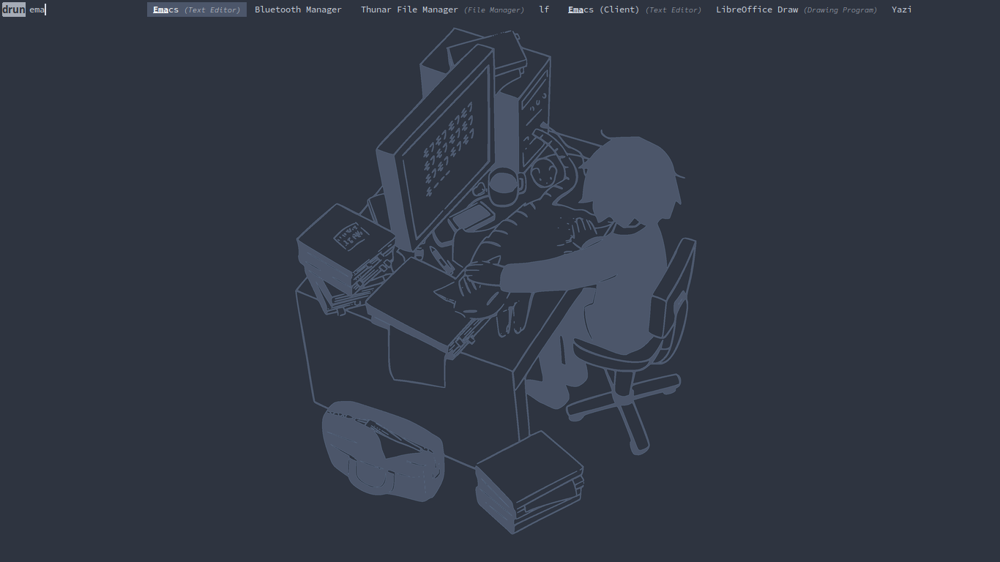
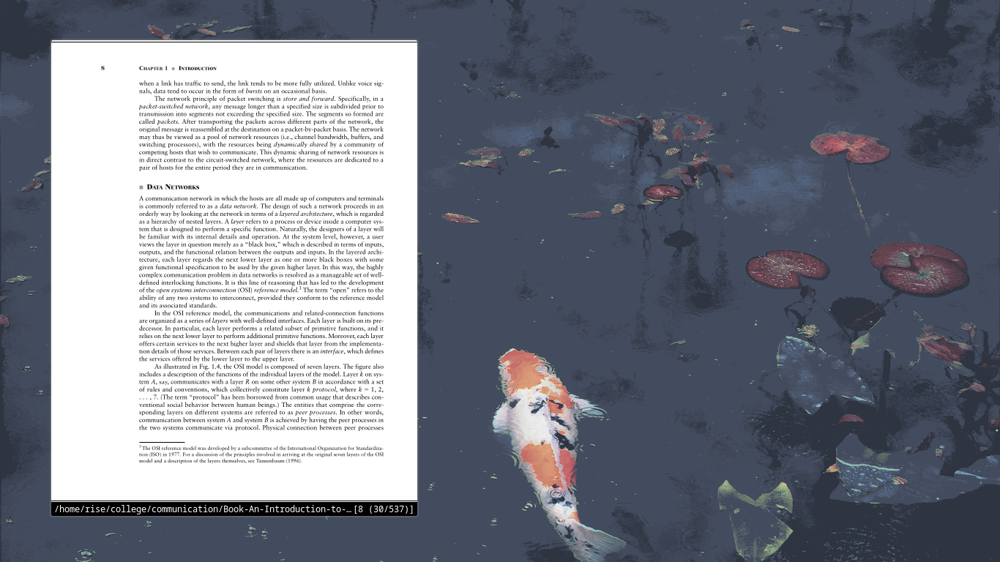
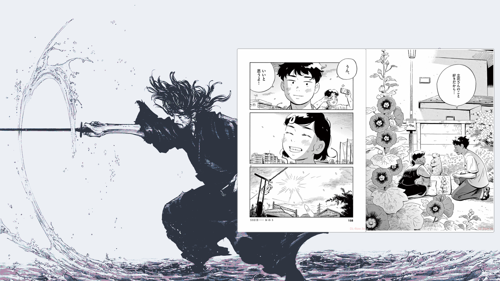

[Nord](https://www.nordtheme.com/) themed [Hyprland](https://github.com/hyprwm/Hypr) config.

[1. alacritty](https://github.com/alacritty/alacritty)

[2. nvim](https://github.com/neovim/neovim)

[3. lf](https://github.com/gokcehan/lf)

[4. kitty](https://github.com/kovidgoyal/kitty)

[5. waybar](https://github.com/Alexays/Waybar)

[6. rofi](https://github.com/davatorium/rofi)

[7. btop](https://github.com/aristocratos/btop)

[8. Zathura](https://github.com/pwmt/zathura)

[9. nsxiv](https://github.com/nsxiv/nsxiv)

Special Thanks to Stephan Raabe's excellent his [dotfiles](https://gitlab.com/stephan-raabe/dotfiles).
